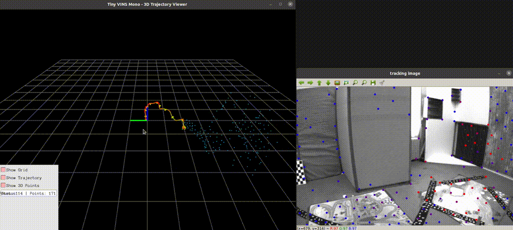

# Tiny VINS Mono

## Introduction

**Tiny VINS Mono** is a lightweight implementation of a monocular Visual-Inertial Navigation System (VINS). This project provides a real-time visual-inertial odometry solution that fuses camera and IMU (Inertial Measurement Unit) data to estimate 6-DOF pose (position and orientation) in 3D space. This algorithm is a refactored version of the well-known VINS-MONO system, designed for educational and research purposes.

### Key Features

- **Monocular Visual-Inertial Odometry**: Combines single camera and IMU data for robust pose estimation
- **Without ROS Dependency**: Standalone implementation that doesn't require ROS (Robot Operating System), making it easier to deploy and integrate into custom applications
- **Real-time Performance**: Optimized for real-time processing with configurable frame skipping
- **Sliding Window Optimization**: Implements a sliding window-based backend optimization using Ceres Solver
- **Feature-based Frontend**: Robust feature tracking and management system
- **3D Visualization**: Real-time trajectory and feature point visualization using Pangolin
- **Configurable Parameters**: Extensive configuration options for different sensors and datasets

### System Architecture

The system consists of three main components:

1. **Frontend**: Feature detection, tracking, and management
2. **Backend**: Pose estimation using sliding window optimization
3. **Utility**: Configuration management, data processing, and visualization

## Getting Started


### Prerequisites

Before building the project, ensure you have the following dependencies installed:

#### Required Dependencies

- **CMake** (>= 2.8)
- **Eigen3**: Linear algebra library
- **OpenCV**: Computer vision library
- **Ceres Solver**: Non-linear optimization library
- **Pangolin**: 3D visualization library
- **yaml-cpp**: YAML configuration file parser

#### Installation on Ubuntu/Debian

```bash
# Update package list
sudo apt update

# Install basic development tools
sudo apt install build-essential cmake git

# Install Eigen3
sudo apt install libeigen3-dev

# Install OpenCV
sudo apt install libopencv-dev

# Install yaml-cpp
sudo apt install libyaml-cpp-dev

# Install Pangolin dependencies
sudo apt install libgl1-mesa-dev libglew-dev libpython2.7-dev pkg-config
sudo apt install libegl1-mesa-dev libwayland-dev libxkbcommon-dev wayland-protocols

# Install Ceres Solver
sudo apt install libceres-dev
```

#### Install Pangolin from Source

**Note**: Pangolin might require additional graphics libraries and can have compilation issues on some systems. Install the required graphics dependencies first:

```bash
# Install graphics dependencies
sudo apt install libgl1-mesa-dev libglew-dev libepoxy-dev
sudo apt install libglfw3-dev pkg-config libwayland-dev

# Clone and build Pangolin
git clone https://github.com/stevenlovegrove/Pangolin.git
cd Pangolin
mkdir build && cd build

# Configure with warning suppression if needed
cmake -DCMAKE_CXX_FLAGS="-Wno-missing-braces" ..
make -j4
sudo make install

# Add to library path
echo 'export LD_LIBRARY_PATH=/usr/local/lib:$LD_LIBRARY_PATH' >> ~/.bashrc
source ~/.bashrc
```

**Alternative**: If building Pangolin fails, you can try using an older stable version:
```bash
git clone https://github.com/stevenlovegrove/Pangolin.git
cd Pangolin
git checkout v0.6  # Use stable version
mkdir build && cd build
cmake ..
make -j4
sudo make install
```

### Building the Project

1. **Clone the repository**
   ```bash
   git clone <repository-url>
   cd tiny_vins_mono
   ```

2. **Create build directory**
   ```bash
   mkdir build
   cd build
   ```

3. **Configure and build**
   ```bash
   cmake ..
   make -j4
   ```

4. **Verify successful build**
   ```bash
   ls tiny_vins_mono
   # You should see the compiled executable
   ```

### Preparing Dataset

The system is designed to work with EuRoC-style datasets. The expected dataset structure is:

```
dataset_folder/
├── mav0/
│   ├── cam0/
│   │   ├── data.csv          # Image timestamps and filenames
│   │   └── data/             # Directory containing image files
│   │       ├── 1403636579763555584.png
│   │       ├── 1403636579813555456.png
│   │       └── ...
│   └── imu0/
│       └── data.csv          # IMU data (timestamp, gyro, accel)
```

#### Download EuRoC Dataset (Example)

```bash
# Create data directory
mkdir -p data/VIO_dataset

# Download V1_01_easy sequence (example)
cd data/VIO_dataset
wget http://robotics.ethz.ch/~asl-datasets/ijrr_euroc_mav_dataset/vicon_room1/V1_01_easy/V1_01_easy.zip
unzip V1_01_easy.zip
```

### Configuration

1. **Edit configuration file**
   ```bash
   # Copy and modify the config file
   cp config/config.yaml config/my_config.yaml
   ```

2. **Update dataset path in config file**
   ```yaml
   # In config/my_config.yaml
   dataset_path: ./data/VIO_dataset/V1_01_easy
   ```

3. **Camera calibration parameters**
   - Update camera intrinsic parameters (`fx`, `fy`, `cx`, `cy`)
   - Set distortion parameters (`k1`, `k2`, `p1`, `p2`)
   - Configure camera-IMU extrinsic parameters if known

4. **Processing parameters**
   ```yaml
   frame_skip: 2              # Process every 3rd frame (0 = all frames)
   max_cnt: 150              # Maximum number of features to track
   min_dist: 30              # Minimum distance between features
   ```

### Running the System

1. **Basic usage**
   ```bash
   # From the build directory
   ./tiny_vins_mono ../config/config.yaml
   ```

2. **Expected output**
   ```
   IMU file: ./data/VIO_dataset/V1_01_easy/mav0/imu0/data.csv
   Image CSV file: ./data/VIO_dataset/V1_01_easy/mav0/cam0/data.csv
   Image directory: ./data/VIO_dataset/V1_01_easy/mav0/cam0/data
   Config file: ../config/config.yaml
   
   Starting Visualizer in main thread...
   🎯 Frame 5 | Time: 1403636580.213 | Cam Pos: [0.01, -0.02, 0.05]
   🎯 Frame 10 | Time: 1403636580.413 | Cam Pos: [0.03, -0.01, 0.08]
   ...
   ```

    

### Understanding the Output

- **Real-time Visualization**: A Pangolin window will open showing:
  - Camera trajectory (green line)
  - Current camera pose (coordinate frame)
  - 3D feature points (red points)
  - Camera frustum

- **Console Output**: 
  - Frame processing progress
  - Camera position at regular intervals
  - Processing statistics

- **Result Files**: 
  - Trajectory data is automatically saved to files for later analysis
  - Use `scripts/compare_trajectories.py` for trajectory evaluation


## Acknowledgments

This implementation is inspired by and builds upon the excellent work in the visual-inertial odometry research community, particularly the VINS-Mono system and related publications.